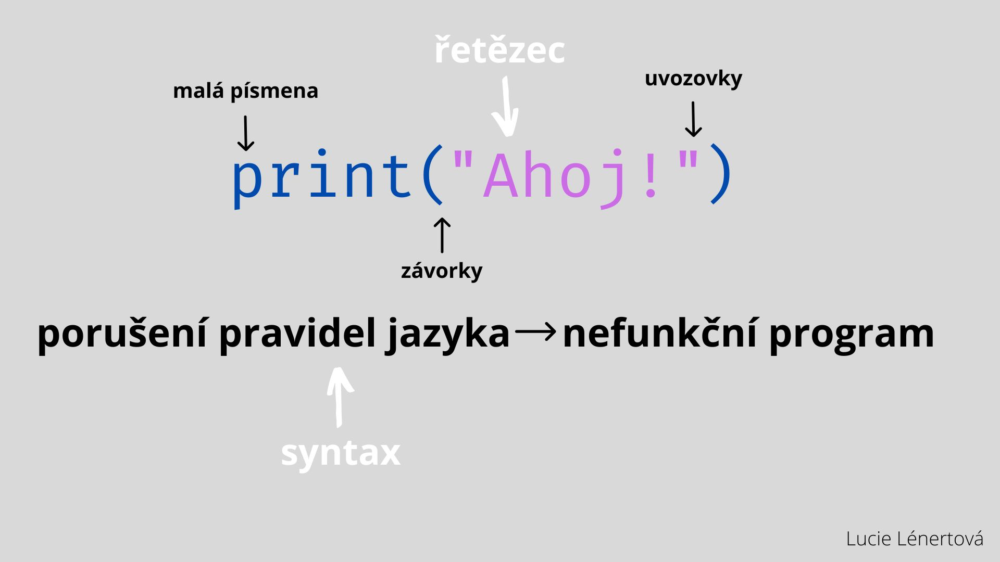

## Řetězce a print příkaz

### Úkol - Přidej svůj kód!

- na řádky 2,3,4 přidej svůj vlastní kód 
- pomocí print funkce vytiskni do konzole své jméno, věk , záliby... Je to na tobě!

### Výzva
- příjdeš na to, jak pomocí funkce print vytisknout prázdný řádek?
  
### Kód nefunguje? 
- hledáš výstup programu v části Console ?
- máš na začátku komentáře dvojkřížek (#) ?
- nechybí ti uvozovky či závorky?
- máš příkaz print malými písmeny?

